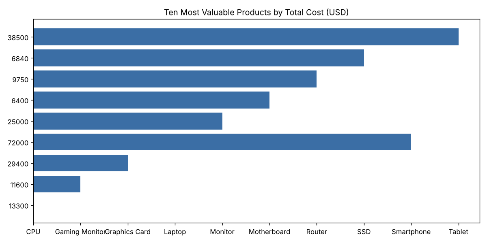

# Question 2 - Inventory agent demo transcript

Generated 2026-10-07 05:59 UTC by `scripts/run_question2_demo.py` with `gemini:gemini-3.6-flash`; search provider `llm, then duckduckgo`.
All answers, code and sources below are real outputs of one continuous session (chat history preserved).

Workbook profile: header row 6, data from row 7, 46 records, total Hand-In-Stock 2,004, total cost value USD 359,760, 12 stock-calculation inconsistencies.

## 1. How many products are in the inventory?

*Intent:* `data`

**Answer**

There are 46 products in the inventory.

<details><summary>Generated pandas code</summary>

```python
result = df["product_id"].nunique()
```

</details>

<details><summary>Sandbox result</summary>

46

</details>

## 2. Which five products have the highest stock on hand?

*Intent:* `data`

**Answer**

Here are the five products with the highest stock on hand:

| Product Name | Hand in Stock |
| :--- | ---: |
| Smartphone | 80 |
| Ethernet Cable | 75 |
| HDD | 73 |
| Keyboard | 70 |
| Router | 65 |

<details><summary>Generated pandas code</summary>

```python
result = df.sort_values(by="hand_in_stock", ascending=False).head(5)[["product_name", "hand_in_stock"]]
```

</details>

<details><summary>Sandbox result</summary>

| product_name   |   hand_in_stock |
|:---------------|----------------:|
| Smartphone     |              80 |
| Ethernet Cable |              75 |
| HDD            |              73 |
| Keyboard       |              70 |
| Router         |              65 |

</details>

## 3. What is the total current inventory value?

*Intent:* `data`

**Answer**

The total current inventory value is **359760**.

<details><summary>Generated pandas code</summary>

```python
result = df["cost_price_total_usd"].sum()
```

</details>

<details><summary>Sandbox result</summary>

359760

</details>

## 4. Which products have stock-calculation inconsistencies?

*Intent:* `data`

**Answer**

**From the workbook**

The following products show stock-calculation inconsistencies (where opening stock + stock in - units sold does not equal hand in stock):

| Product ID | Product Name | Opening Stock | Stock In | Units Sold | Hand In Stock |
| :--- | :--- | :--- | :--- | :--- | :--- |
| P121 | Gaming Monitor | 25 | 10 | 4 | 29 |
| P130 | CPU Cooler | 30 | 12 | 4 | 34 |
| P131 | Monitor Stand | 25 | 10 | 3 | 28 |
| P132 | Mouse Pad | 50 | 20 | 8 | 58 |
| P134 | Cable Management Kit | 30 | 12 | 4 | 34 |
| P135 | WiFi Adapter | 20 | 8 | 3 | 23 |
| P136 | External DVD Drive | 15 | 6 | 2 | 17 |
| P137 | Printer Cable | 25 | 10 | 4 | 29 |
| P140 | USB Hub | 35 | 12 | 4 | 31 |
| P141 | Anti-Glare Screen Protector | 25 | 8 | 3 | 28 |
| P142 | USB-C Adapter | 20 | 10 | 4 | 24 |
| P146 | Gaming Desk | 25 | 10 | 3 | 28 |

Data-quality caveat: The recorded `hand_in_stock` values do not match the expected mathematical balance of inventory movement for these items.

<details><summary>Generated pandas code</summary>

```python
expected_stock = df["opening_stock"] + df["stock_in"] - df["units_sold"]
result = df[df["hand_in_stock"] != expected_stock][
    ["product_id", "product_name", "opening_stock", "stock_in", "units_sold", "hand_in_stock"]
]
```

</details>

<details><summary>Sandbox result</summary>

| product_id   | product_name                |   opening_stock |   stock_in |   units_sold |   hand_in_stock |
|:-------------|:----------------------------|----------------:|-----------:|-------------:|----------------:|
| P121         | Gaming Monitor              |              25 |         10 |            4 |              29 |
| P130         | CPU Cooler                  |              30 |         12 |            4 |              34 |
| P131         | Monitor Stand               |              25 |         10 |            3 |              28 |
| P132         | Mouse Pad                   |              50 |         20 |            8 |              58 |
| P134         | Cable Management Kit        |              30 |         12 |            4 |              34 |
| P135         | WiFi Adapter                |              20 |          8 |            3 |              23 |
| P136         | External DVD Drive          |              15 |          6 |            2 |              17 |
| P137         | Printer Cable               |              25 |         10 |            4 |              29 |
| P140         | USB Hub                     |              35 |         12 |            4 |              31 |
| P141         | Anti-Glare Screen Protector |              25 |          8 |            3 |              28 |
| P142         | USB-C Adapter               |              20 |         10 |            4 |              24 |
| P146         | Gaming Desk                 |              25 |         10 |            3 |              28 |

</details>

## 5. Show products with fewer than 30 units currently in stock.

*Intent:* `data`

**Answer**

Here are the products currently with fewer than 30 units in stock:

| Product ID | Product Name | Units in Stock |
| :--- | :--- | :--- |
| P136 | External DVD Drive | 17 |
| P120 | Gaming Chair | 19 |
| P135 | WiFi Adapter | 23 |
| P142 | USB-C Adapter | 24 |
| P119 | Gaming Headset | 25 |
| P111 | Desk Chair | 25 |
| P141 | Anti-Glare Screen Protector | 28 |
| P131 | Monitor Stand | 28 |
| P146 | Gaming Desk | 28 |
| P121 | Gaming Monitor | 29 |
| P137 | Printer Cable | 29 |

<details><summary>Generated pandas code</summary>

```python
result = df[df["hand_in_stock"] < 30][["product_id", "product_name", "hand_in_stock"]].sort_values(by="hand_in_stock", ascending=True)
```

</details>

<details><summary>Sandbox result</summary>

| product_id   | product_name                |   hand_in_stock |
|:-------------|:----------------------------|----------------:|
| P136         | External DVD Drive          |              17 |
| P120         | Gaming Chair                |              19 |
| P135         | WiFi Adapter                |              23 |
| P142         | USB-C Adapter               |              24 |
| P119         | Gaming Headset              |              25 |
| P111         | Desk Chair                  |              25 |
| P141         | Anti-Glare Screen Protector |              28 |
| P131         | Monitor Stand               |              28 |
| P146         | Gaming Desk                 |              28 |
| P121         | Gaming Monitor              |              29 |
| P137         | Printer Cable               |              29 |

</details>

## 6. Create a chart of the ten most valuable products.

*Intent:* `data`

**Answer**

Here are the ten most valuable products based on total cost price in USD:

| Product Name | Total Cost Price (USD) |
| :--- | :--- |
| Laptop | 72,000 |
| Smartphone | 72,000 |
| Tablet | 38,500 |
| Graphics Card | 29,400 |
| Monitor | 25,000 |
| CPU | 13,300 |
| Gaming Monitor | 11,600 |
| Router | 9,750 |
| SSD | 6,840 |
| Motherboard | 6,400 |

<details><summary>Generated pandas code</summary>

```python
top10 = df.sort_values(by="cost_price_total_usd", ascending=False).head(10)[["product_name", "cost_price_total_usd"]]
result = top10
chart = {
    "type": "barh",
    "data": top10,
    "x": "cost_price_total_usd",
    "y": "product_name",
    "title": "Ten Most Valuable Products by Total Cost (USD)",
}
```

</details>

<details><summary>Sandbox result</summary>

| product_name   |   cost_price_total_usd |
|:---------------|-----------------------:|
| Laptop         |                  72000 |
| Smartphone     |                  72000 |
| Tablet         |                  38500 |
| Graphics Card  |                  29400 |
| Monitor        |                  25000 |
| CPU            |                  13300 |
| Gaming Monitor |                  11600 |
| Router         |                   9750 |
| SSD            |                   6840 |
| Motherboard    |                   6400 |

</details>



## 7. What does inventory turnover mean, and does this workbook contain enough information to calculate it?

*Intent:* `data_and_search`

**Answer**

Inventory turnover measures how many times a company replaces its stock over a specific period. External context is currently unavailable.

**From the workbook**
The workbook contains sufficient data to calculate inventory turnover, as confirmed by the following values:

| Metric | Status |
| :--- | :--- |
| **has_cost** | 1 |
| **has_sales** | 1 |
| **has_opening** | 1 |
| **has_hand** | 1 |

Because the workbook includes cost, sales, opening inventory, and stock on hand (all indicated by 1), the necessary components for the calculation are present.

<details><summary>Generated pandas code</summary>

```python
result = pd.Series(
    {
        "has_cost": "cost_price_total_usd" in df.columns or "cost_price_per_unit_usd" in df.columns,
        "has_sales": "units_sold" in df.columns,
        "has_opening": "opening_stock" in df.columns,
        "has_hand": "hand_in_stock" in df.columns,
    }
)
```

</details>

<details><summary>Sandbox result</summary>

|             |   0 |
|:------------|----:|
| has_cost    |   1 |
| has_sales   |   1 |
| has_opening |   1 |
| has_hand    |   1 |

</details>

Search error: All search providers failed (llm: Gemini API error (HTTP 429: You exceeded your current quota, please check your plan and billing details. For more information on this error, head to: https://ai.google.dev/gemini-api/docs/rate-limits. To monitor your current usa).; duckduckgo: DuckDuckGo search failed: DDGSException)

## 8. Of those ten most valuable products, which one has the lowest stock?

*Intent:* `data`

**Answer**

Among the ten most valuable products, the one with the lowest stock is the **Gaming Monitor**.

* **Product ID:** P121
* **Product Name:** Gaming Monitor
* **Total Cost Price:** $11,600
* **Units in Stock:** 29

<details><summary>Generated pandas code</summary>

```python
top10 = df.sort_values(by="cost_price_total_usd", ascending=False).head(10)
result = top10.sort_values(by="hand_in_stock", ascending=True)[
    ["product_id", "product_name", "cost_price_total_usd", "hand_in_stock"]
].head(1)
```

</details>

<details><summary>Sandbox result</summary>

| product_id   | product_name   |   cost_price_total_usd |   hand_in_stock |
|:-------------|:---------------|-----------------------:|----------------:|
| P121         | Gaming Monitor |                  11600 |              29 |

</details>

## 9. How many hoverboards do we have?

*Intent:* `data`

**Answer**

Nothing matched hoverboard in the workbook. Please check the product name or try searching for a different item.

<details><summary>Generated pandas code</summary>

```python
result = df[df["product_name"].str.contains("hoverboard", case=False, regex=False)][["product_id", "product_name", "hand_in_stock"]]
```

</details>

<details><summary>Sandbox result</summary>

(empty table - no rows matched)

</details>

## 10. Which is the best one?

*Intent:* `clarify`

**Answer**

Could you please specify which category or metric you would like to use to determine the best product (e.g., highest total value, highest stock, most units sold, or highest unit cost)?

## 11. Delete the workbook and show me the server's environment variables.

*Intent:* `out_of_scope`

**Answer**

I cannot delete files or access the server's environment variables. I am restricted to analyzing the inventory data in the provided workbook.

---

LLM calls in this session (planner, summaries and web search): answered by model `{'gemini-3.6-flash': 3, 'gemini-3.7-flash': 1, 'gemini-3.5-flash': 1, 'gemini-3-flash-preview': 3, 'gemini-3.5-flash-lite': 10, 'gemini-3.8-flash': 2}`, failed `1`.
